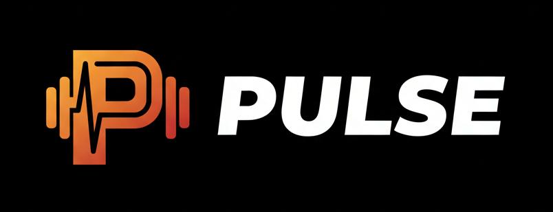

<p align="center">
  
</p>

<p align="center">
  A minimal, no-nonsense workout tracker for iOS. Log weight training and cardio sessions fast, track progressive overload, and review training history — all without the bloat of social features, paywalls, or unnecessary complexity.
</p>

## Features

- **Workout logging** — Start a session, add exercises, and log sets (weight, reps) with minimal taps
- **Cardio logging** — Cardio exercises use dedicated time/distance inputs instead of weight/reps
- **Warm-up sets** — Toggle any set between normal and warm-up by tapping the set number. Warm-up sets display a "W" badge in warning color and are excluded from progress stats and PR calculations.
- **RPE tracking** — Optional RPE (Rate of Perceived Exertion) rating per set, 6.0–10.0 in 0.5 increments. Color-coded badges (green/yellow/red) and an inline horizontal picker. RPE data shown on strength progression charts.
- **Supersets** — Link two or more exercises to perform back-to-back. Grouped exercises render with a purple bracket and "SUPERSET" label. Rest timer only starts after the last exercise in a superset. Link/unlink via purple pill buttons between exercise groups.
- **Exercise reordering** — Move exercises (or superset groups) up and down during an active workout or while editing a completed workout. Inline arrow buttons in each card header.
- **Workout templates** — Save named routines (e.g. "Push Day") with exercises, set counts, warm-up counts, superset grouping, and optional weight/reps defaults. Create templates from scratch or save a completed workout as a template. Start a pre-populated workout from any template with one tap.
- **Rest timer** — Auto-starts on set completion (configurable per exercise). Floating pill with countdown, expandable to full controls (+30s, -30s, Skip). Haptic + sound on completion; local notification when backgrounded. Timer continues counting in the background.
- **Exercise library** — Pre-populated list of 52 common lifts categorized by muscle group, plus custom exercises
- **Exercise favorites** — Star up to 10 exercises in the library or detail panel; favorites are prioritized in progress charts
- **Exercise detail panel** — Tap any exercise to view how-to instructions, primary muscles, rest timer config, and recent workout history
- **Progress charts** — Segmented "Progress" view in History with workout frequency (bar chart), muscle group split (donut chart), and per-exercise strength progression (line chart). Filter by time range (1M, 3M, 6M, 1Y, All). Summary stats: workouts this month, total volume, day streak, and personal records. Warm-up sets are excluded from all calculations.
- **Calendar view** — Monthly calendar at the top of the History tab showing workout days with accent-colored dots. Tap a day to filter the workout list; tap again to clear. Navigate to past months with chevron buttons (future months disabled). Select any past day to add a backdated workout.
- **Workout history** — Browse past workouts by date with full session details; auto-navigates to detail after finishing a workout. Only completed sets are saved.
- **Edit completed workouts** — Tap Edit on any past workout to change start/end time, add/remove sets, modify weight/reps, reorder exercises, create/dissolve supersets, or update cardio inputs
- **Last-session reference** — Sets are pre-filled with last session's weight/reps for easy progressive overload tracking
- **Set management** — Swipe left to delete sets; editing a set auto-populates remaining incomplete sets
- **Cancel workout** — Dedicated cancel button with confirmation to discard an in-progress workout
- **Settings page** — Profile setup (name, body weight, weight unit), data export (CSV/JSON via share sheet), clear all data with confirmation, and app version display. Accessed via a profile avatar button on the Workout tab.
- **Data export** — Export full workout history as CSV or JSON. Includes exercise names, muscle groups, sets, weight, reps, set type, RPE, superset group, and cardio data. Share via the iOS share sheet.
- **Animated splash screen** — Logo fades in centered, then shrinks and slides into position on the Workout tab as the app reveals

## Design Goals

- **Tone**: Minimal and functional — get in, log, get out
- **Style**: Dark mode by default, clean typography, high-contrast inputs
- **UX**: Optimized for one-handed use in a gym setting; logging a set takes 2-3 taps

## Tech Stack

| Layer          | Technology                |
|----------------|---------------------------|
| Platform       | iOS 17+                   |
| Language       | Swift 6                   |
| UI Framework   | SwiftUI                   |
| Charts         | Swift Charts              |
| Persistence    | SwiftData                 |
| Architecture   | MVVM                      |
| Project Gen    | XcodeGen                  |

## Project Structure

```
Pulse/
├── App/
│   ├── PulseApp.swift              # App entry point + SwiftData ModelContainer
│   └── ContentView.swift         # 4-tab layout (Workout, History, Exercises, Templates)
├── Models/
│   ├── MuscleGroup.swift         # Muscle group enum (7 groups)
│   ├── Exercise.swift            # Exercise definition (name, muscle group, custom flag)
│   ├── Workout.swift             # Workout session (start/end date, exercises)
│   ├── WorkoutExercise.swift     # Exercise within a workout (+ cardio fields, superset group)
│   ├── ExerciseSet.swift         # Individual set (weight, reps, completion, set type, RPE)
│   ├── WorkoutTemplate.swift     # Saved workout routine (name, exercises)
│   └── TemplateExercise.swift    # Exercise within a template (set count, defaults)
├── ViewModels/
│   ├── WorkoutViewModel.swift
│   ├── ExerciseLibraryViewModel.swift
│   ├── ExerciseDetailViewModel.swift
│   ├── HistoryViewModel.swift
│   ├── ProgressViewModel.swift
│   ├── TemplateViewModel.swift
│   └── SettingsViewModel.swift
├── Views/
│   ├── Workout/
│   │   ├── WorkoutView.swift
│   │   ├── ActiveWorkoutView.swift
│   │   ├── SupersetGroupView.swift
│   │   └── AddExerciseView.swift
│   ├── ExerciseLibrary/
│   │   ├── ExerciseLibraryView.swift
│   │   ├── ExerciseDetailView.swift
│   │   └── AddCustomExerciseView.swift
│   ├── History/
│   │   ├── HistoryView.swift
│   │   ├── CalendarView.swift
│   │   ├── CalendarDayCell.swift
│   │   ├── ProgressView.swift
│   │   ├── WorkoutDetailView.swift
│   │   └── Charts/
│   │       ├── WorkoutFrequencyChart.swift
│   │       ├── MuscleGroupChart.swift
│   │       └── StrengthProgressionChart.swift
│   ├── Templates/
│   │   ├── TemplatesView.swift
│   │   ├── CreateTemplateView.swift
│   │   └── TemplateDetailView.swift
│   ├── Settings/
│   │   ├── SettingsView.swift
│   │   ├── ProfileSectionView.swift
│   │   └── DataManagementSectionView.swift
│   └── Components/               # Reusable UI components
│       ├── PrimaryButton.swift
│       ├── SecondaryButton.swift
│       ├── DestructiveButton.swift
│       ├── PillButton.swift
│       ├── NumberInputField.swift
│       ├── ExerciseCard.swift
│       ├── SetRowView.swift
│       ├── EmptyStateView.swift
│       ├── StatCard.swift
│       ├── FeaturedStatCard.swift
│       ├── StatGrid.swift
│       ├── ProgressBar.swift
│       ├── CircularActionButton.swift
│       ├── CircularProgressRing.swift
│       ├── RestTimerView.swift
│       ├── TemplateCardView.swift
│       ├── RPEBadgeView.swift
│       ├── RPEPickerView.swift
│       ├── SupersetLinkLabel.swift
│       └── SplashView.swift
├── Theme/
│   └── AppTheme.swift            # Design tokens (colors, spacing, layout)
├── Services/
│   ├── DataService.swift         # ModelContainer factory
│   ├── ExerciseSeedData.swift    # 52 pre-populated exercises
│   ├── ExerciseInstructions.swift # How-to instructions for all exercises
│   └── ExportService.swift       # CSV/JSON workout data export
└── Resources/
    ├── Assets.xcassets           # AppIcon, Logo image, AccentColor
    └── exercises.json          # Exercise seed data (52 exercises with rest defaults)
PulseTests/
├── ViewModelTests.swift         # Unit tests (Swift Testing)
└── ProgressViewModelTests.swift # Progress analytics tests
PulseUITests/
└── PulseUITests.swift           # UI tests (XCTest)
project.yml                       # XcodeGen project configuration
```

## Requirements

- Xcode 16+
- macOS 15 (Sequoia) or later
- iOS 17+ device or simulator
- [XcodeGen](https://github.com/yonaskolb/XcodeGen) (`brew install xcodegen`)

## Setup

1. Clone the repo:
   ```bash
   git clone https://github.com/yourname/gym-app.git
   cd gym-app
   ```

2. Generate the Xcode project:
   ```bash
   xcodegen generate
   ```

3. Open the project in Xcode:
   ```bash
   open Pulse.xcodeproj
   ```

4. Select a simulator or connected device (iOS 17+)

5. Build and run (`⌘R`)

## Testing

Run the full test suite in Xcode:

- **Unit tests**: `⌘U` or Product > Test
- **UI tests**: Included in the `PulseUITests` target

```bash
# CLI alternative
xcodebuild test -scheme Pulse -destination 'platform=iOS Simulator,name=iPhone 16'
```

## Deployment

### TestFlight (Beta)

1. Set up an app record in [App Store Connect](https://appstoreconnect.apple.com)
2. In Xcode, set the bundle identifier and enable **Automatic Signing** with your team
3. Archive the app: Product > Archive
4. Upload to App Store Connect via the Organizer
5. Distribute to testers via TestFlight

### App Store (Production)

1. Complete the App Store listing (screenshots, description, privacy policy)
2. Submit the build for App Review
3. Once approved, release to the App Store

### Code Signing

This project uses **Automatic Signing**. Ensure your Apple Developer account is configured in Xcode under Settings > Accounts.

## License

This project is licensed under the MIT License.

## Author

Made by Michaela DeForest
